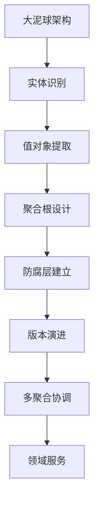

# DDD实践 - 代码演进过程详解

## 🎯 演进概览

这个项目展示了从"大泥球"架构到清晰DDD架构的完整演进过程，体现了以下几个重要的演进路径：



## 📚 第一阶段：从大泥球到基础领域模型

### 问题背景
传统的大泥球架构通常表现为：
- 所有业务逻辑混杂在一个巨大的类中
- 数据结构和业务行为耦合
- 外部系统依赖直接暴露在业务逻辑中
- 难以测试、维护和扩展

### 大泥球代码示例（重构前）

```java
/**
 * 大泥球式的酒店预订服务 - 一切都混在一起
 */
public class HotelBookingService {

    private DatabaseConnection db;
    private InventorySystemClient inventory;
    private PriceSystemClient priceSystem;
    private PaymentGateway payment;
    private NotificationService notify;

    public BookingResult bookHotel(String userId, String hotelId, String roomType, LocalDate checkIn, LocalDate checkOut) {
        try {
            // 1. 用户验证 & 信息获取（本应属于用户领域）
            ResultSet user = db.executeQuery("SELECT level FROM users WHERE id = '" + userId + "'");
            if (!user.next()) throw new RuntimeException("用户不存在");
            String level = user.getString("level");

            // 2. 房间基本信息查询（本应属于酒店领域）
            ResultSet room = db.executeQuery("SELECT id, base_price FROM rooms WHERE hotel_id = '" + hotelId +
                                             "' AND type = '" + roomType + "'");
            if (!room.next()) throw new RuntimeException("房型不存在");
            String roomId = room.getString("id");
            BigDecimal price = room.getBigDecimal("base_price");

            // 3. 可用性检查（本应在库存子系统中处理）
            if (!inventory.checkAvailability(roomId, checkIn, checkOut).isAvailable()) {
                throw new RuntimeException("无可用房间");
            }

            // 4. 价格计算（本应封装成策略或价格领域服务）
            if ("VIP".equals(level)) price = price.multiply(new BigDecimal("0.9"));
            if (isHoliday(checkIn)) price = price.multiply(new BigDecimal("1.2"));

            // 5. 外部价格系统比价（未加防腐层）
            try {
                BigDecimal extPrice = priceSystem.getPrice(hotelId, roomType, checkIn).getPrice();
                if (extPrice.compareTo(price) < 0) price = extPrice;
            } catch (Exception e) {
                System.err.println("价格系统失败: " + e.getMessage());
            }

            // 6. 处理支付（非预订职责）
            PaymentResult pay = payment.process(userId, price);
            if (!pay.isSuccess()) throw new RuntimeException("支付失败");

            // 7. 创建订单（直接数据库操作）
            String bookingId = UUID.randomUUID().toString();
            db.executeUpdate("INSERT INTO bookings (id, user_id, room_id, price) VALUES ('" +
                             bookingId + "', '" + userId + "', '" + roomId + "', " + price + ")");

            // 8. 通知用户（基础设施职责）
            notify.sendSMS(userId, "预订成功: " + bookingId);

            // 9. 返回结果
            BookingResult result = new BookingResult();
            result.setBookingId(bookingId);
            result.setTotalPrice(price);
            result.setStatus("CONFIRMED");
            return result;

        } catch (Exception e) {
            throw new RuntimeException("预订失败: " + e.getMessage());
        }
    }

    private boolean isHoliday(LocalDate date) {
        return date.equals(LocalDate.of(2025, 10, 1)); // 示例：国庆节
    }
}
```

### 大泥球架构的问题分析

**1. 单一职责原则严重违背**：
- 一个类承担了预订、价格计算、支付、通知、库存管理等多重职责

**2. 业务逻辑和技术实现强耦合**：
- 业务规则硬编码在技术实现中
- 数据库操作和业务逻辑混杂

**3. 外部系统依赖直接暴露**：
- 没有防腐层保护
- 外部系统变化直接影响业务逻辑

**4. 业务规则难以变更**：
- 价格计算规则硬编码
- 添加新的折扣规则需要修改核心方法

**5. 测试困难**：
- 方法过于庞大，依赖过多
- 难以进行单元测试

**6. 可维护性差**：
- 代码结构混乱，理解困难
- 修改一个小功能可能影响整个系统

### 初始重构：HotelOffer V1

```java
/**
 * 酒店产品聚合根 - 第一版
 * 从大泥球中提取出的核心业务概念
 */
public class HotelOffer {
    // 基础属性
    String offerNo;
    HotelProduct products;
    List<PriceRule> priceRuleList;
    Validity validity;
    
    /**
     * 核心业务方法：计算最低价格
     * 将分散的价格计算逻辑封装在聚合根内
     */
    public BigDecimal calculateMinPrice(LocalDate checkInDay, 
                                       Map<String, ? extends AbstractPriceData> roomPriceData) {
        // 业务规则：验证日期可用性
        // 价格计算逻辑：遍历价格规则，计算最优价格
        // 聚合内部协调：产品、规则、有效期的组合逻辑
    }
}
```

**关键改进**：
1. **业务概念清晰化**: 明确了HotelOffer作为酒店产品的核心概念
2. **封装业务规则**: 将价格计算逻辑封装在聚合根内部
3. **依赖倒置**: 通过AbstractPriceData抽象外部价格数据

### 重构对比总结

#### 🔴 重构前（大泥球）
```java
// 一个巨大的方法包含所有业务逻辑
public BookingResult bookHotel(String userId, String hotelId, /* 8个参数 */) {
    // 200+ 行代码包含：
    // - 用户验证（SQL查询）
    // - 酒店验证（SQL查询） 
    // - 房间检查（SQL查询）
    // - 复杂价格计算（硬编码规则）
    // - 外部系统调用（没有封装）
    // - 支付处理
    // - 数据库操作
    // - 通知发送
}
```

#### 🟢 重构后（DDD）
```java
// 清晰的领域模型和职责分离
public class HotelOffer {
    // 只关注酒店产品的核心业务
    public BigDecimal calculateMinPrice(LocalDate checkInDay, 
                                       Map<String, ? extends AbstractPriceData> roomPriceData) {
        // 封装的业务逻辑，外部复杂性被隔离
    }
}

public class UserPricingStrategy {
    // 专门处理用户定价策略
    public BigDecimal calculateUserDiscount(BigDecimal basePrice, UserContext userContext) {
        // 灵活的策略计算，支持时效性和多维度规则
    }
}

public class ComprehensivePricingDomainService {
    // 协调多个聚合，处理复杂业务流程
    public static PricingResult calculateFinalPrice(/* 清晰的参数 */) {
        // 清晰的步骤：基础价格 → 用户策略 → 营销策略
    }
}
```

#### 🎯 重构收益对比

| 维度 | 重构前（大泥球） | 重构后（DDD） |
|------|-----------------|---------------|
| **代码行数** | 单个方法200+行 | 多个职责清晰的小方法 |
| **业务概念** | 混杂不清 | 聚合根、实体、值对象清晰 |
| **测试性** | 难以单元测试 | 每个组件可独立测试 |
| **扩展性** | 修改影响全局 | 职责分离，影响局部 |
| **可读性** | 需要深入理解所有细节 | 业务概念一目了然 |
| **维护性** | 高风险，牵一发动全身 | 低风险，职责边界清晰 |

## 🔄 第二阶段：防腐层的建立

### 外部系统集成挑战
随着业务发展，需要集成多个外部系统：
- 价格数据系统（版本不断演进）
- 库存管理系统
- 第三方OTA平台

### PriceData 演进过程

#### PriceData V1: 基础版本
```java
public class PriceData extends AbstractPriceData {
    private String roomNo;
    private List<PricePair> pricePairList;  // 简单的价格对列表
    
    @Override
    public BigDecimal getMinPriceByDay(LocalDate day) {
        // 简单的日期匹配和价格查找
    }
}
```

#### PriceDataV2: 增强版本
```java
public class PriceDataV2 extends AbstractPriceData {
    private String roomNo;
    private List<TimingPrice> timingPriceList;  // 支持时间维度的价格
    
    @Override
    public BigDecimal getMinPriceByDay(LocalDate day) {
        // 支持多时段价格，选择最优价格
        return timingPriceList.stream()
                .filter(timingPrice -> timingPrice.getDay().isEqual(day))
                .map(TimingPrice::getPrice)
                .min(BigDecimal::compareTo)
                .orElseThrow();
    }
    
    // 内部类：支持时间维度的价格
    private class TimingPrice {
        private BigDecimal price;
        private LocalTime timing;
        private LocalDate day;
    }
}
```

### 防腐层设计：PriceDataAdapter

```java
/**
 * 价格数据适配器 - 防腐层的核心
 * 目标：将外部价格数据转换为聚合根友好的领域概念
 */
public class PriceDataAdapter {
    
    /**
     * 关键设计：将外部数据结构适配为领域接口
     */
    public static RoomPriceQuery adaptToPriceQuery(
            Map<String, ? extends AbstractPriceData> externalPriceData) {
        return new RoomPriceQuery() {
            @Override
            public BigDecimal queryRoomMinPrice(String roomNo, LocalDate day) {
                AbstractPriceData priceData = externalPriceData.get(roomNo);
                if (priceData == null) {
                    throw new RuntimeException("No price data found for room: " + roomNo);
                }
                return priceData.getMinPriceByDay(day);
            }
            
            @Override
            public boolean hasDataForRoom(String roomNo) {
                return externalPriceData.containsKey(roomNo);
            }
        };
    }
    
    /**
     * 领域友好的接口：隐藏外部系统复杂性
     */
    public interface RoomPriceQuery {
        BigDecimal queryRoomMinPrice(String roomNo, LocalDate day);
        boolean hasDataForRoom(String roomNo);
    }
}
```

**防腐层的价值**：
1. **隔离变化**: 外部系统变化不影响核心业务逻辑
2. **领域友好**: 提供符合业务语言的接口
3. **版本兼容**: 支持多版本外部系统同时存在

## 🚀 第三阶段：聚合根演进

### HotelOfferV2: 支持客户选择策略

业务需求变化：需要支持不同的客户选择策略（固定价格、最低价格等）

```java
/**
 * 酒店产品聚合根V2
 * 新增：客户选择策略支持
 */
public class HotelOfferV2 {
    String offerNo;
    HotelProduct products;
    CustomerChoice customerChoice;  // 新增：客户选择策略
    List<PriceRule> priceRuleList;
    Validity validity;
    
    /**
     * 价格计算支持策略模式
     */
    public BigDecimal calculateMinPrice(LocalDate checkInDay, 
                                       Map<String, ? extends AbstractPriceData> roomPriceData) {
        return priceRuleList.stream().map(priceRule -> {
            DateRange occupationDateRange = products.minOccupationDateRange(checkInDay);
            return occupationDateRange.toStream()
                    .map(calculatedDay -> products.getHotelProducts().stream()
                            .map(room -> priceRule.getPrice(calculatedDay, 
                                    roomPriceData.get(room.getRoomNo()).getMinPriceByDay(calculatedDay)))
                            .reduce(getMinimalPriceCalculateMethod(customerChoice))  // 策略应用
                            .orElse(BigDecimal.ZERO))
                    .reduce(BigDecimal::add)
                    .orElseThrow(() -> new RuntimeException("price is not available"));
        }).min(BigDecimal::compareTo)
          .orElseThrow(() -> new RuntimeException("price is not available"));
    }
    
    /**
     * 策略模式实现：根据客户选择确定计算方法
     */
    private BinaryOperator<BigDecimal> getMinimalPriceCalculateMethod(CustomerChoice customerChoice) {
        if (customerChoice == CustomerChoice.FIXED) {
            return BigDecimal::add;      // 固定价格：累加
        } else {
            return BigDecimal::min;      // 最低价格：取最小
        }
    }
}
```

**演进亮点**：
1. **策略模式**: 通过CustomerChoice支持不同的价格计算策略
2. **向后兼容**: 保持原有接口不变，添加新功能
3. **业务规则封装**: 策略选择逻辑完全封装在聚合根内部

### HybridOffer: 组合产品支持

业务进一步演进：需要支持酒店+景点的组合产品

```java
/**
 * 混合产品聚合根
 * 支持酒店+景点的组合产品
 */
@Data
@AllArgsConstructor
public class HybridOffer {
    private ProductGroups productGroups;  // 产品组合
    private String offerNo;
    private List<PriceRule> priceRuleList;
    private Validity validity;
    private CustomerChoice customerChoice;
    
    /**
     * 组合产品价格计算
     */
    public BigDecimal getMinPriceV3(LocalDate checkInDay, 
                                    Map<String, ? extends AbstractPriceData> priceData) {
        // 验证可用性
        if (!validity.validateCheckInDayIsAvailable(checkInDay)) {
            throw new RuntimeException("checkInDay is not available");
        }
        
        // 计算酒店部分价格
        HotelProduct hotelProduct = productGroups.getHotelProduct();
        BigDecimal hotelPrice = calculateHotelPrice(checkInDay, priceData, hotelProduct);
        
        // 计算景点部分价格
        AttractionProduct attractionProduct = productGroups.getAttractionProduct();
        BigDecimal attractionPrice = calculateAttractionPrice(checkInDay, priceData, attractionProduct);
        
        // 组合价格
        return hotelPrice.add(attractionPrice);
    }
    
    /**
     * 获取不同产品类型的标识符列表
     */
    public List<String> getHotelRoomList() {
        return productGroups.getHotelProduct().getHotelProducts().stream()
                .map(RoomInfo::getRoomNo)
                .collect(Collectors.toList());
    }
    
    public List<String> getAttractionTicketList() {
        return productGroups.getAttractionProduct().getProductItemList().stream()
                .map(TicketItem::getProductNumber)
                .collect(Collectors.toList());
    }
}
```

**关键创新**：
1. **组合模式**: 通过ProductGroups管理不同类型的产品
2. **统一接口**: 对外提供一致的价格计算接口
3. **扩展性**: 易于添加新的产品类型

## 🏗️ 第四阶段：多聚合协调与领域服务

### 问题：跨聚合的复杂业务逻辑

随着业务复杂度增加，出现了跨多个聚合的复杂业务场景：
- 用户定价策略（基于用户属性）
- 营销定价策略（基于市场活动）
- 综合定价逻辑（协调多个策略）

### 用户定价策略聚合根

```java
/**
 * 用户定价策略聚合根
 * 职责：管理基于用户属性的定价策略（等级、地域、渠道等）
 */
public class UserPricingStrategy {
    private String strategyId;
    private String strategyName;
    private boolean active;
    private PriorityLevel strategyPriority;
    
    // 时效性支持
    private LocalDateTime effectiveStartTime;
    private LocalDateTime effectiveEndTime;
    private DateRange validDateRange;
    
    // 策略组件
    private List<UserLevelDiscount> userLevelDiscounts;
    private List<RegionPricing> regionPricings;
    private List<ChannelPricing> channelPricings;
    private PriorityRule priorityRule;
    
    /**
     * 核心业务方法：计算用户策略折扣
     */
    public BigDecimal calculateUserDiscount(BigDecimal basePrice, 
                                           UserContext userContext, 
                                           LocalDateTime currentTime) {
        // 时效性验证
        if (!isEffectiveAt(currentTime)) {
            return basePrice;
        }
        
        BigDecimal finalPrice = basePrice;
        
        // 按优先级应用策略
        if (priorityRule.shouldApplyUserLevel()) {
            finalPrice = applyUserLevelDiscount(finalPrice, userContext.getUserLevel());
        }
        
        if (priorityRule.shouldApplyRegion()) {
            finalPrice = applyRegionPricing(finalPrice, userContext.getRegion());
        }
        
        if (priorityRule.shouldApplyChannel()) {
            finalPrice = applyChannelPricing(finalPrice, userContext.getChannel());
        }
        
        return finalPrice;
    }
    
    /**
     * 时效性验证：策略在指定时间是否有效
     */
    public boolean isEffectiveAt(LocalDateTime checkTime) {
        if (!active) return false;
        
        if (effectiveStartTime != null && checkTime.isBefore(effectiveStartTime)) {
            return false;
        }
        
        if (effectiveEndTime != null && checkTime.isAfter(effectiveEndTime)) {
            return false;
        }
        
        if (validDateRange != null) {
            LocalDate checkDate = checkTime.toLocalDate();
            return validDateRange.contains(checkDate);
        }
        
        return true;
    }
}
```

### 营销定价策略聚合根

```java
/**
 * 营销定价策略聚合根
 * 职责：管理节假日、限时活动等可配置的营销策略
 */
public class MarketingPricingStrategy {
    private String strategyId;
    private String strategyName;
    private StrategyType strategyType;
    private boolean active;
    private DateRange effectivePeriod;
    private PriorityLevel priorityLevel;
    
    // 不同类型的营销策略
    private List<HolidayPricing> holidayPricings;
    private List<FlashSaleActivity> flashSaleActivities;
    private List<SeasonalPricing> seasonalPricings;
    
    /**
     * 计算营销策略价格
     */
    public BigDecimal calculateMarketingPrice(BigDecimal basePrice, 
                                            LocalDate targetDate, 
                                            MarketingContext context) {
        if (!isEffective(targetDate)) {
            return basePrice;
        }
        
        BigDecimal finalPrice = basePrice;
        
        // 根据策略类型应用不同的定价逻辑
        switch (strategyType) {
            case HOLIDAY_PRICING:
                finalPrice = applyHolidayPricing(finalPrice, targetDate);
                break;
            case FLASH_SALE:
                finalPrice = applyFlashSaleActivity(finalPrice, targetDate, context);
                break;
            case SEASONAL_PRICING:
                finalPrice = applySeasonalPricing(finalPrice, targetDate);
                break;
            case COMBINED:
                finalPrice = applyCombinedStrategy(finalPrice, targetDate, context);
                break;
        }
        
        return finalPrice;
    }
}
```

### 领域服务：ComprehensivePricingDomainService

```java
/**
 * 综合定价领域服务
 * 职责：协调 HotelOffer 基础价格、用户策略定价、营销策略定价，计算最终价格
 */
public class ComprehensivePricingDomainService {
    
    /**
     * 计算综合最终价格
     * 体现了领域服务协调多个聚合根的职责
     */
    public static PricingResult calculateFinalPrice(
            HotelOffer hotelOffer,
            LocalDate checkInDay,
            Map<String, ? extends AbstractPriceData> roomPriceData,
            UserContext userContext,
            MarketingContext marketingContext,
            List<UserPricingStrategy> userPricingStrategies,
            List<MarketingPricingStrategy> marketingPricingStrategies) {
        
        // 1. 计算基础价格 (HotelOffer聚合根)
        BigDecimal basePrice = HotelPricingDomainService.calculateMinPrice(
            hotelOffer, checkInDay, roomPriceData);
        
        // 2. 应用用户策略定价 (UserPricingStrategy聚合根)
        BigDecimal userDiscountedPrice = applyUserPricingStrategies(
            basePrice, userContext, userPricingStrategies);
        
        // 3. 应用营销策略定价 (MarketingPricingStrategy聚合根)
        BigDecimal marketingPrice = applyMarketingPricingStrategies(
            userDiscountedPrice, checkInDay, marketingContext, marketingPricingStrategies);
        
        // 4. 构建定价结果
        return buildPricingResult(basePrice, userDiscountedPrice, marketingPrice, 
            checkInDay, userContext, marketingContext);
    }
    
    /**
     * 应用用户定价策略
     * 使用策略选择器来管理多策略选择逻辑
     */
    private static BigDecimal applyUserPricingStrategies(
            BigDecimal basePrice, 
            UserContext userContext, 
            List<UserPricingStrategy> strategies) {
        
        // 使用策略选择器，默认选择最优价格策略
        return UserPricingStrategySelector.calculateBestUserPrice(
                basePrice, 
                userContext, 
                strategies, 
                UserPricingStrategySelector.SelectionMode.BEST_PRICE
        );
    }
    
    /**
     * 应用营销定价策略
     */
    private static BigDecimal applyMarketingPricingStrategies(
            BigDecimal userDiscountedPrice,
            LocalDate checkInDay,
            MarketingContext marketingContext,
            List<MarketingPricingStrategy> strategies) {
        
        if (strategies == null || strategies.isEmpty()) {
            return userDiscountedPrice;
        }
        
        // 按优先级排序策略
        strategies.sort((s1, s2) -> Integer.compare(
            s2.getPriorityLevel().getLevel(), s1.getPriorityLevel().getLevel()));
        
        BigDecimal bestMarketingPrice = userDiscountedPrice;
        
        // 应用营销策略，选择最优价格
        for (MarketingPricingStrategy strategy : strategies) {
            if (strategy.isEffective(checkInDay)) {
                BigDecimal strategyPrice = strategy.calculateMarketingPrice(
                    userDiscountedPrice, checkInDay, marketingContext);
                
                if (strategyPrice.compareTo(bestMarketingPrice) < 0) {
                    bestMarketingPrice = strategyPrice;
                }
            }
        }
        
        return bestMarketingPrice;
    }
}
```

### 策略选择器：UserPricingStrategySelector

```java
/**
 * 用户定价策略选择器
 * 职责：管理多个用户定价策略的选择逻辑和优先级
 */
public class UserPricingStrategySelector {
    
    /**
     * 策略选择模式
     */
    public enum SelectionMode {
        BEST_PRICE,        // 选择最优价格（价格最低）
        HIGHEST_PRIORITY,  // 选择最高优先级策略
        FIRST_APPLICABLE   // 选择第一个适用的策略
    }
    
    /**
     * 根据选择模式计算最终用户价格
     */
    public static BigDecimal calculateBestUserPrice(
            BigDecimal basePrice,
            UserContext userContext,
            List<UserPricingStrategy> strategies,
            SelectionMode mode,
            LocalDateTime checkTime) {
        
        // 过滤出适用且在有效期内的策略
        List<UserPricingStrategy> applicableStrategies = strategies.stream()
                .filter(strategy -> strategy.isApplicableForUser(userContext, checkTime))
                .toList();
        
        if (applicableStrategies.isEmpty()) {
            return basePrice;
        }
        
        return switch (mode) {
            case BEST_PRICE -> selectByBestPrice(basePrice, userContext, applicableStrategies, checkTime);
            case HIGHEST_PRIORITY -> selectByHighestPriority(basePrice, userContext, applicableStrategies, checkTime);
            case FIRST_APPLICABLE -> selectFirstApplicable(basePrice, userContext, applicableStrategies, checkTime);
        };
    }
}
```

## 📈 演进总结与价值

### 1. 架构演进路径
```
大泥球 → 基础聚合根 → 防腐层 → 聚合根演进 → 多聚合协调 → 领域服务
```

### 2. 关键设计原则
- **聚合边界清晰**: 每个聚合负责一个业务概念
- **防腐层隔离**: 保护核心业务逻辑不受外部系统影响
- **领域服务协调**: 处理跨聚合的复杂业务逻辑
- **策略模式应用**: 支持业务规则的灵活变化

### 3. 业务价值体现
- **灵活的定价策略**: 支持复杂的多维度定价规则
- **时效性管理**: 支持策略的时间控制和动态调整
- **可扩展架构**: 易于添加新的业务规则和策略类型
- **高可维护性**: 清晰的业务概念映射，便于理解和修改

### 4. 技术债务管理
- **向后兼容**: 通过版本控制支持平滑演进
- **渐进式重构**: 避免大爆炸式重写，降低风险
- **测试覆盖**: 确保业务规则的正确性

这个演进过程展示了DDD在复杂业务领域中的实际应用价值，以及如何通过合理的架构设计来应对不断变化的业务需求。